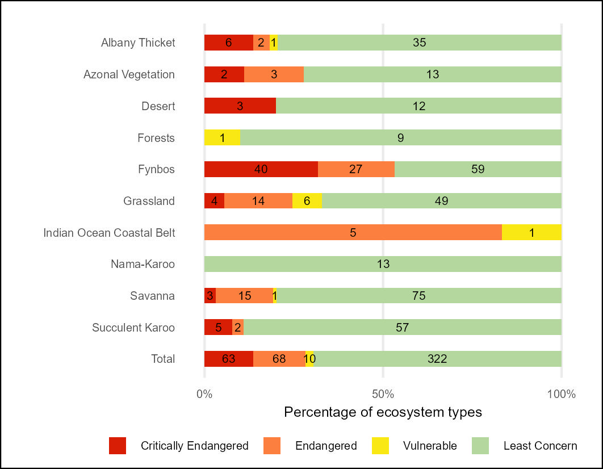
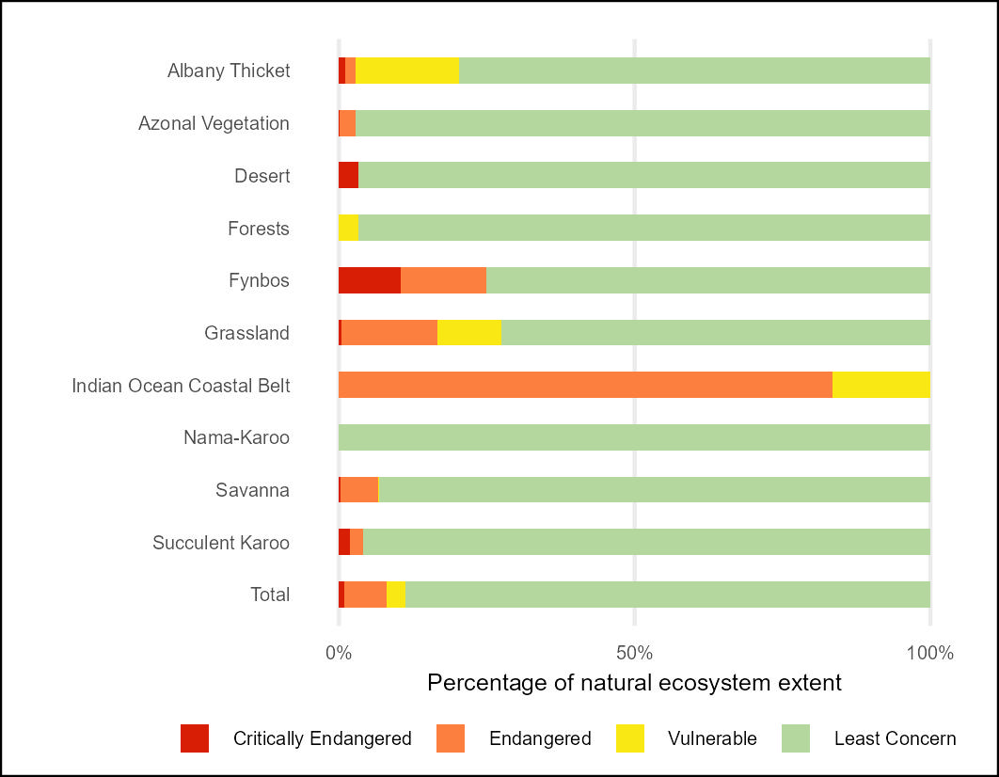

## Workflows for undertaking the terrestrial Red List of Ecosystems (RLE) assessment

### **National Biodiversity Assessment - South Africa**

*South African National Biodiversity Institute (SANBI)*

April 2025

#### Summary

*This Repository contains a series of workflows that together result in the 2025 Red List of Ecosystems for Terrestrial Ecosystems of South Africa. The terrestrial ecosystem types assessed are represented by the terrestrial vegetation units contained in the National Vegetation Map 2024 (released by SANBI in January 2025).*

1.  Calculate Criterion A3 using the national land cover data 7 class version (SANBI 2024) [RLE2024_A3.qmd](RLE2024_A3.qmd);

2.  Calculate Criterion A2b and B1i and B2i using national land cover data 7 class version (SANBI 2024) [RLE2024_A2b.qmd](RLE2024_A2b.qmd);

3.  Calculate Criterion B1iii & B2iii using EOO and AOO plus a model of ongoing decline based on the Red List of Threatened Species database (SANBI 2024). At least 30 threatened species, with a density of at least 0.15 per km2, and 60% of threatened species threatened by either disrupted fire regimes, over-use by livestock or alien plant invasions [RLE2024_B_species.qmd](RLE2024_B_species.qmd);

4.  Collate all assessments for all criteria [RLE_compilation.qmd](RLE_compilation.qmd) using the three assessments above plus these **supplementary** assessments:

-   Criterion A3 assessments using Western Cape (Cape Nature), KwaZulu-Natal (EKZN), Mpumalanga land cover data (MPTA). Workflow in the LCC_terr repo [WC_KZN_MPL_LC.qmd](WC_KZN_MPL_LC.qmd)

-   Criterion A3, B1, B2, and D3 assessments using City of Cape Town BioNet data on land cover and ecosystem condition (CoCT, 2024) . Workflow in the LCC_terr repo [CoCT_LC_Condition.qmd](CoCT_LC_Condition.qmd)

-   Criterion B1, B2, D3 assessments using a combined invasive alien plant layer that includes: a) the National Invasive Alien Plant Survey data ([Kotze et al., 2025](https://doi.org/10.1007/s10530-025-03558-9)), b) the CFR Invasive Alien Tree Survey data ([Rebelo et al. 2024](https://doi.org/10.25413/SUN.27377211)), c) the MAPWAPS IAP data ([Skosana et al., 2024a](https://doi.org/10.25413/SUN.25050368), [Skosana et al., 2024b](https://doi.org/10.25413/SUN.25050401), [Cogill et al., 2024a](https://doi.org/10.25413/SUN.25066151), [Cogill et al., 2024b](https://doi.org/10.25413/SUN.25050314)), d) Unmgeni-uThukela EI for Water Security (EI4WS) project (SANBI, Geonest and INR 2024). Workflow in the INV_terr repo [INV_terr/Invasives_percentages_all.qmd](INV_terr/Invasives_percentages_all.qmd)

-   Criterion D3 assessments using STEP ecosystem condition data (Lloyd et al., 2022). Workflow in the LCC_terr repo [STEP_Condition.qmd](STEP_Condition.qmd)

-   Criterion D3 assessments using Little Karoo ecosystem condition data (Thompson et al., 2009). Workflow in the LCC_terr repo [LittleKaroo_Condition.qmd](LittleKaroo_Condition.qmd)

-   Criterion D3 assessments using Nelson Mandela Bay Metro ecosystem condition data. Workflow in the LCC_terr repo [NMB_Condition.qmd](NMB_Condition.qmd)

#### Calculating metrics of ecosystem extent and assessing RLE Criteria A3

R tidy script ([RLE2024_A3.qmd](RLE2024_A3qmd)) in Quarto format shows how land cover change metrics [(LCC_terr/outputs/lc7_rall.csv)](askowno/LCC_terr/ouputs/lc7_rall.csv) from the Land Cover Change workflow ([LCC_terr/LC_change_7class_veg24.qmd](askowno/LCC_terr/LC_change_7class_veg24.qmd)) were ingested and summarised, and then used in assessment of RLE Criterion A3.

For Criterion A3 the key metric is the ecosystem extent remaining in natural condition at each time point expressed as a proportion of the historical / potential extent of the ecosystem type (e.g. extent2022/ext1750). This is used to assess Criterion A3 for each ecosystem type. The results are captured in wide ([outputs/results_A3w.csv](outputs/results_A3w.csv)) and long ([outputs/results_A3.csv](outputs/results_A3.csv)) formats.

#### Calculating rate of decline in ecosystem extent and assessing RLE Criteria A2b and then using this in Criterion B

R tidy script ([RLE2024_A2b.qmd](RLE2024_A2b.qmd)) in Quarto format showing how land cover change metrics [(LCC_terr/outputs/lc7_rall.csv)](askowno/LCC_terr/ouputs/lc7_rall.csv) from the Land Cover Change workflow ([LCC_terr](askowno/LCC_terr/LC_change_7class_veg24.qmd)) were ingested and summarised, and then used in assessment of RLE Criterion A2b.

For Criterion A2b the key metrics relate to the rate of habitat loss (decline in ecosystem extent), and the use of these to project ecosystem extent forward to 2040, and then assess the proportion of 1990 extent that will be lost over a 50 year period to 2040. This information is used to assess Criterion A2b for each ecosystem type. The results for A2 and B1irod and B2irod are captured in wide ([outputs/results_A2b.csv](outputs/results_A2b.csv)) format.

1.  Compute the absolute rate of decline in ecosystem extent (ARD) over the period 1990 to 2022, the period 1990-2014, 2014-2022 and 2018-2022 (to provide recent trend).
2.  This ARD can be used to estimate ecosystem extent in 2040 to allow for computation of Criterion A2b (recent and ongoing declines). The simplest approach is to calculate the rate of decline in natural extent per year and then multiply by 50 to get the projected extent in 2040 (i.e. ext2040 = ARD9022 / 32 \* 50 ).
3.  Then subtract this from the 1990 extent and divide by the 1990 ext to get the proportional decline in extent over a 50 year period (i.e. proportion lost over 50 years = (ext1990 - ext2040/ext1990) .
4.  In addition to this we projected the 2040 extent using ARD for 1990-2014 (previous), for 2014-2022, for 2018-2022 (to provide recent trends).
5.  To complement these simple calculations we included three models of decline i) linear, ii) quadratic and iii) a monotonic spline.
6.  RoD (%/y) is an additional metric (i.e. R0D9022 = ARD9022/32) used in Criterion B as evidence of ongoing decline (if the ROD \>= 0.4%/y this is consider substantial ongoing decline - it will result in loss of 30% of remaining habitat in 10 years). The ROD for three periods was calculated to allow assessor to gauge the level of ongoing threat that direct habitat loss presents (i.e. RoD9022, RoD9014, RoD1422 and RoD1822 were calculated). The default ROD used was RoD9022 (ie linear rate of loss between 1990 and 2022).

#### Supplementary assessments of criteria A3, B1, B2, and D3

The results from the supplementary assessments listed above were ingested and compiled.

-   Western Cape, KwaZuluNatal and Mpumalanga (WC, KZN, MPL) A3 results ([askowno/LCC_terr/outputs/alt_sum.csv](askowno/LCC_terr/outputs/alt_sum.csv))

-   City of Cape Town (CoCT) A3 and D3 results ([askowno/LCC_terr/outputs/coct_sum.csv](askowno/LCC_terr/outputs/coct_sum.csv))

-   Little Karoo (LK) D3 results ([askowno/LCC_terr/outputs/lk_sum.csv](askowno/LCC_terr/outputs/lk_sum.csv))

-   Subtropical Ecosystem Project (STEP) D3 results ([askowno/LCC_terr/outputs/step_sum.csv](askowno/LCC_terr/outputs/step_sum.csv))

-   Nelson Mandela Bay Metro (NMB) D3 results ([askowno/LCC_terr/outputs/nmb_sum.csv](askowno/LCC_terr/outputs/nmb_sum.csv))

-   Combined invasive alien plant B1i, B2i and D3 results ([askowno/INV_terr/outputs/data_for_rle_inv_max2.csv](askowno/INV_terr/outputs/data_for_rle_inv_max2.csv))

-   Note that two additional condition data sets were analysed but showed very low levels of degradation - and were omitted from this compilation: Hardeveld degradation study (Bell et al. 2021) <https://github.com/askowno/LLC_terr/blob/main/Hardeveld_Condition.qmd> & Little Karoo degradation study (Kirsten et al. 2023) <https://github.com/askowno/LLC_terr/blob/main/LittleKaroo_Kirsten_Condition.qmd>

#### RLE overall, and status for each criterion calculated

Once all the results were compiled into a single table ([RLE_compilation.qmd](RLE_compilation.qmd)) the highest risk category for each ecosystem was selected, and each contributing criterion was captured. Key metrics, required in the reporting of RLE were also captured (e.g. extent remaining, EOO, AOO, percentage invaded) ([outputs/RLE_full_compiled.csv](outputs/RLE_full_compiled.csv)). Final adjustments and supplementary assessments undertaken by experts (Vlok & Vlok, 2020 [SKv11]; Jurgens et al., 2025 [SKr7, SKr2, SKr13]) and manual corrections of ecosystems on the threshold of categories were added as a final step ([outputs/RLE_full_compiled_adjusted.csv](outputs/RLE_full_compiled_adjusted.csv)).

| RLE 2024 - Ecosystem count per category | RLE 2024 - Ecosystem extent per category |
|------------------------------------|------------------------------------|
|  |  |

#### Combined RLE and EPL results

The results of the RLE and EPL assessments can be viewed together at a type level : [ter_results_type_rle_epl.csv](outputs/ter_results_type_rle_epl.csv)

These are simplified for integration purposes with other realms here: [outpus/ter_results_for_integration.csv](outpus/ter_results_for_integration.csv)

These are summarised into per Biome RLE_EPL classes to identify ünluckyecosystems) here: [RLE_EPL_ter_results_summary.csv](outputs/RLE_EPL_ter_results_summary.csv)

***A quarter of terrestrial ecosystem types (115 / 463) are highly-threatened (CR/EN) AND under-protected (PP/NP)***

***Fynbos fares worst with 40% of types (50/126) in this situation***

write.csv(ter_results_type, file = "outputs/ter_results_type_rle_epl.csv") write.csv(ter_results_for_integration, file = "outputs/ter_results_for_integration.csv") write.csv(ter_results_sum_unlucky, file = "outputs/ter_results_sum_unlucky.csv")
